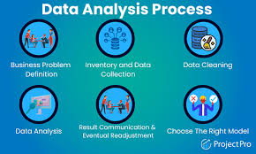
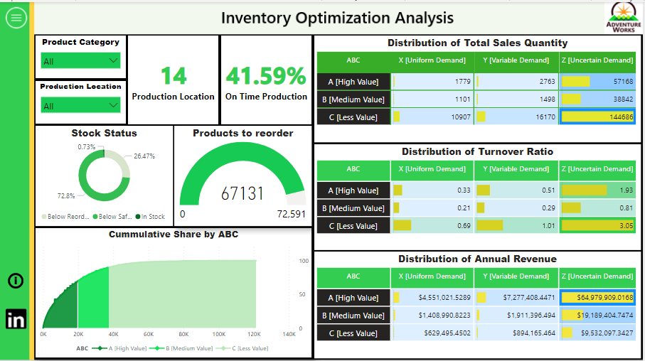
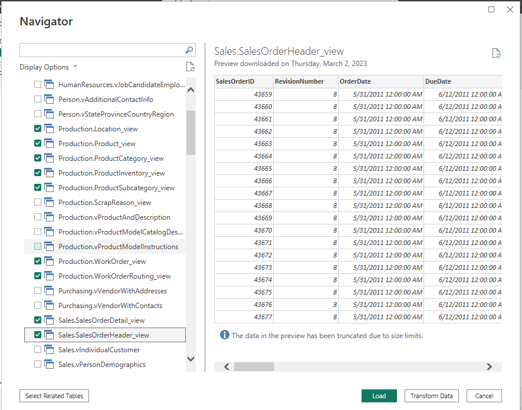

# SUPERSTORE-ANALYSIS
This is an analysis of a superstore in lagos nigeria

# INTRODUCTION
This peoject is gnhi that naalysis sperstore inlagos nigeria, and it was done usog micrdoft excel
I analysed data from dim_customers table, dim_date table, dim_product table, dim_territory sales and fact_internet sales table. I used SQL

# PROBLEM STATEMENT
The goal of this analysis is to

- Determine the current market demand for products and how it varies by region/location
- Know the current sales performance and how it compares to past performance and industry benchmarks
- identify the areas where sales performance is lacking or could be improved.

# DATA SOURCE
 UIYUIYIUY IYOIUIO
 U GIU GUI YI
HI UYIUY

# DATA ANALYSIS

